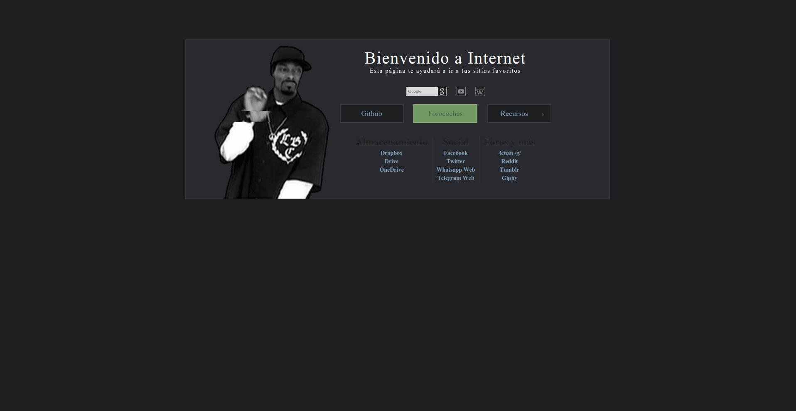

Custom Homepage
==



Este repositorio contiene una página de inicio personalizada hecha usando HTML, CSS y Javascript (jQuery). No dudeis en descargar y modificar. Comentarios y sugerencias serán apreciadas. Es algo muy simple, hecho simplemente por entretenimiento.

Características:
----
* Links con color animado.
* Sublinks animados.
* Barras de búsqueda animadas.
* Imagenes seleccionadas de un array personalizado (acepta gifs).
* Links customizados por columnas.
* Disponibles temas "Light & Dark".
* Simple estructura de directorios para el libre intercambio de temas e imágenes.

Personalización, añadiendo mascotas y temas
----
Para cambiar el tema actual, ponga su nombre en [home.html](home.html#L15-17)

Para personalizar las mascotas en el tema `ruri-dark`, modificar el array contenido en [themes/ruri-dark/mascots.js](themes/ruri-dark/mascots.js):
```javascript
var mascotList = [ "ruri1.png", "ruri2.png", "ruri3.png" ];
```

Para crear un nuevo tema, puedes copiar uno existente, y cambiar las imagenes y [colors.css](themes/ruri-dark/colors.css) como tu quieras.  
Las entradas en el fichero de tu tema [mascots.js](themes/ruri-dark/mascots.js) deben coincidir con las imagenes en el directorio de [mascots/](themes/ruri-dark/mascots/).  
(Por supuesto, los links superiores usan el tema `ruri-dark` solo como un ejemplo.)

Disclaimer
----
Imagen de prueba (gif) obtenida legalmente de [Giphy.com](https://giphy.com).
